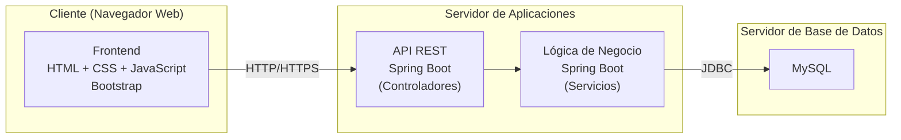

#  Justificación de Arquitectura y Tecnologías

##  Justificación de la Arquitectura

La arquitectura de software seleccionada para el desarrollo del proyecto se basa en un enfoque de **API REST** junto con una **arquitectura en capas**, lo cual permite una organización clara, modular y escalable del sistema.

La elección de una API REST facilita la comunicación entre cliente y servidor mediante el uso de estándares ampliamente adoptados, lo que garantiza interoperabilidad, facilidad de integración con otros sistemas y una mayor flexibilidad para futuras expansiones, como aplicaciones móviles o servicios externos.

Por otra parte, la arquitectura en capas permite dividir el sistema en diferentes niveles (por ejemplo: presentación, lógica de negocio y acceso a datos), lo cual favorece la separación de responsabilidades. Esto no solo mejora la mantenibilidad del código, sino que también facilita la detección de errores, la reutilización de componentes y el trabajo colaborativo entre los integrantes del equipo.

Adicionalmente, se opta por el uso de metodologías ágiles debido a su enfoque iterativo e incremental, lo cual resulta especialmente adecuado para un equipo de aprendices del SENA. Estas metodologías permiten adaptarse a cambios, recibir retroalimentación constante y realizar entregas parciales funcionales, facilitando así el aprendizaje progresivo y la mejora continua del proyecto.

En conjunto, la combinación de API REST, arquitectura en capas y metodologías ágiles proporciona una base sólida para el desarrollo del proyecto, asegurando calidad, organización y capacidad de adaptación a futuros requerimientos.

---

##  Tecnologías Recomendadas por Capa

### 1. Capa de Presentación (Frontend)

Encargada de la interacción con el usuario y consumo de la API REST.

**Opciones:**

* HTML, CSS y JavaScript
* Bootstrap (para diseño responsivo)
* Angular
* React

**Recomendación:**

* Nivel básico: HTML + JavaScript + Bootstrap
* Nivel intermedio/avanzado: Angular

---

###  2. Capa de Aplicación (API REST / Controladores)

Encargada de gestionar las solicitudes HTTP (GET, POST, PUT, DELETE).

**Opciones:**

* Java con Spring Boot
* Node.js con Express
* Python con Django REST Framework

**Recomendación:**

* Spring Boot (por facilidad de uso, integración y enfoque académico)

---

###  3. Capa de Lógica de Negocio (Servicios)

Contiene las reglas del negocio y procesamiento de datos.

**Opciones:**

* Implementación dentro del backend:

  * En Spring Boot: clases con anotación @Service
  * En Node.js: servicios separados

**Buenas prácticas:**

* Validaciones
* Reglas de negocio
* Manejo de datos
* Restricciones

---

###  4. Capa de Acceso a Datos (Persistencia)

Encargada de la comunicación con la base de datos.

**Opciones:**

* Bases de datos:

  * MySQL
  * PostgreSQL

**Recomendación:**

* MySQL

---

##  Herramientas Complementarias

* Control de versiones: Git + GitHub
* Pruebas de API: Postman
* Documentación: Visual Estudio Code
* Gestión ágil: Clickup

---

##  Arquitectura Recomendada

* Frontend: Angular o HTML + Bootstrap
* Backend: Spring Boot
* Base de datos: MySQL
* Pruebas: Postman
* Control de versiones: GitHub

---

## Diagrama de despliegue

---

##  Recomendación Final

Se recomienda utilizar un conjunto de tecnologías que el equipo pueda manejar adecuadamente, priorizando la simplicidad, la correcta implementación y el funcionamiento completo del sistema, en lugar de incorporar herramientas innecesarias que compliquen el desarrollo.

---
## Observaciones

Tenemos en cuenta que probablemente no estamos escogiendo las tecnologias más optimas para desarrollar nuestro sistema de información justo en este momento, no obstante decidimos seguir este planteamiento teniendo en cuenta los temas desarrollado en la formación del tecnólogo.
